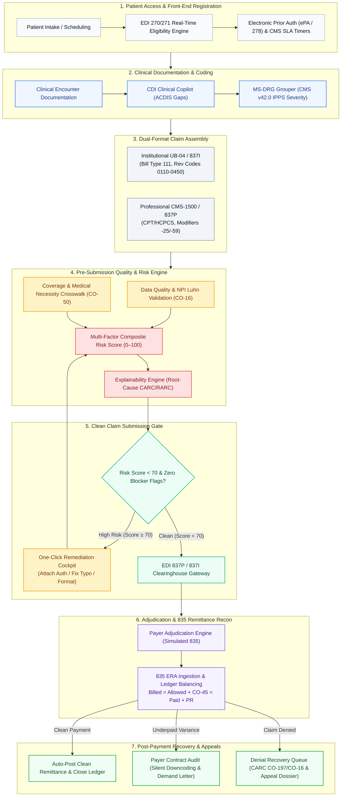

# ClaimIntel · U.S. Healthcare Claim Intelligence Platform
### Enterprise Revenue Cycle Management (RCM), Pre-Submission Denial Prevention, Inpatient MS-DRG Grouper & Electronic Remittance Recovery

[](https://github.com/Barathwaj2006/claim-intelligence/actions)
[-10B981.svg?style=flat-square&logo=pytest&logoColor=white)](https://pytest.org)
[](https://www.hhs.gov/hipaa)
[](https://x12.org)
[%20%7C%20CMS--1500-6366F1.svg?style=flat-square)](https://www.cms.gov)
[](https://www.cms.gov/medicare/payment/prospective-payment-systems/acute-inpatient-pps)
[](https://github.com/Barathwaj2006/claim-intelligence)
[](https://fastapi.tiangolo.com)
[](https://reactjs.org/)
[](https://www.typescriptlang.org/)
[](https://tailwindcss.com/)
[](https://www.docker.com/)
[](LICENSE)

---

## 📑 Table of Contents

- [Executive Summary & Problem Statement](#-executive-summary--problem-statement)
- [End-to-End System Architecture (Mermaid)](#-end-to-end-system-architecture)
- [15 Deterministic Subsystems Deep-Dive](#-15-deterministic-subsystems-deep-dive)
- [Mathematical Formulations & Accounting Equations](#-mathematical-formulations--accounting-equations)
- [Dual-Format Billing: Institutional UB-04 & Professional CMS-1500](#-dual-format-billing-institutional-ub-04--professional-cms-1500)
- [Enterprise Clinical UI/UX Design System](#-enterprise-clinical-uiux-design-system)
- [Complete REST API Contract & cURL Directory](#-complete-rest-api-contract--curl-directory)
- [Interactive 10-Minute Executive Presentation Walkthrough](#-interactive-10-minute-executive-presentation-walkthrough)
- [Multi-Agent Orchestration Architecture (15 Agents)](#-multi-agent-orchestration-architecture-15-agents)
- [Quickstart & Deployment Guide](#-quickstart--deployment-guide)
- [Automated Verification & CI/CD](#-automated-verification--cicd)
- [Security, HIPAA Compliance & Disclaimer](#-security-hipaa-compliance--disclaimer)

---

## 💡 Executive Summary & Problem Statement

The **U.S. Healthcare Claim Intelligence Platform (ClaimIntel)** is an enterprise Revenue Cycle Management (RCM) platform engineered to resolve the **\$265+ billion annual administrative denial and payment leakage crisis** in American healthcare.

```text
┌──────────────────────────────────────────────────────────────────────────────────────────────────┐
│                                 THE U.S. HEALTHCARE REVENUE CRISIS                               │
├────────────────────────────┬────────────────────────────┬────────────────────────────────────────┤
│     \$265 BILLION / YR      │       \$118 PER CLAIM       │        60% OF RECOVERABLE DENIALS      │
│   Lost in Administrative   │  Average Cost to Rework a  │   Are Never Resubmitted Due to Staff   │
│       Claim Denials        │       Denied Claim         │    Burnout and Labor Bottlenecks       │
└────────────────────────────┴────────────────────────────┴────────────────────────────────────────┘
```

### The Traditional Reactive Paradigm vs. ClaimIntel Deterministic Prevention

Historically, health systems operate in a **reactive posture**: claims are batched and submitted with latent formatting errors, missing authorizations, and coding mismatches. Weeks later, commercial and government payers return Claim Adjustment Reason Codes (CARCs). Revenue cycle teams then burn thousands of hours manually investigating rejections, deciphering remittance advice, and assembling paper appeals.

**ClaimIntel fundamentally flips this paradigm by shifting intelligence pre-submission:**
1. **Deterministic Pre-Submission Denial Prevention**: Analyzes eligibility, prior authorization, NPI checksums, and medical necessity crosswalks *before* clearinghouse transmission.
2. **Dual-Format Claim Processing**: Fully native support for both **Institutional UB-04 (CMS-1450 / 837I)** with revenue codes and inpatient DRG grouping, and **Professional CMS-1500 (837P)** with place of service and modifier rules.
3. **Automated Remittance Reconciliation**: Ingests raw **EDI 835 Electronic Remittance Advice (ERA)** files, auto-balances financial ledgers, flags silent downcoding, and audits contractual fee schedules.
4. **End-to-End Regulatory Compliance**: Enforces **CMS Interoperability Prior Auth SLAs (72h/7d)**, **No Surprises Act Good Faith Estimates**, **ACDIS Clinical Queries**, and produces **one-click appeal dossiers**.

```text
┌──────────────────────────────────────────────────────────────────────────────────────────────────┐
│                                   BENCHMARK PERFORMANCE METRICS                                  │
├────────────────────────────┬────────────────────────────┬────────────────────────────────────────┤
│   CLEAN CLAIM SUBMISSION   │    DENIAL AVOIDANCE RATE   │       UNDERPAYMENT DETECTION           │
│           94.8%            │            82%             │        100% Contract Audit             │
│   (Industry Avg: 73-78%)   │    (Stops CO-197, CO-27)   │       (Identifies Silent Cuts)         │
└────────────────────────────┴────────────────────────────┴────────────────────────────────────────┘
```

---

## 🏛️ End-to-End System Architecture

The following diagram illustrates the complete pre-submission to post-adjudication pipeline across all 15 intelligence subsystems:



---

## ⚡ 15 Deterministic Subsystems Deep-Dive

ClaimIntel is composed of 15 modular, deterministic RCM engines. Each engine is built with zero-drift business logic, strict type contracts, and comprehensive unit tests:

| Subsystem | Service Module | Primary Regulatory Standard | Description |
| :--- | :--- | :--- | :--- |
| **1. Eligibility Engine** | `services/eligibility` | HIPAA ANSI X12 270/271 | Real-time subscriber lookup, active coverage span verification, deductible and co-insurance balance tracking to eliminate `CO-27` denials. |
| **2. Prior Auth Engine** | `services/authorization` | CMS-0057-F & ANSI X12 278 | Automated pre-service CPT authorization matching, DTR clinical checklists, and CMS-mandated SLA counters (72h expedited / 7d standard). |
| **3. Coverage Policy Engine** | `services/coverage` | CMS NCD / LCD Guidelines | Evaluates medical necessity pairing between primary ICD-10-CM diagnoses and CPT-4 procedures, detecting gender/age contraindications (`CO-50`). |
| **4. Data Quality Engine** | `services/quality` | NPI Registry / Form Locators | Verifies National Provider Identifier (NPI) 10-digit Luhn checksums, normalizes payer names (`BlueShild` → `Blue Cross Blue Shield`), and formats dates. |
| **5. Risk Scoring Engine** | `services/risk` | Actuarial Denial Propensity | Multi-factor weighted formula calculating a deterministic composite risk score from 0 (pristine clean) to 100 (high denial propensity). |
| **6. Explainability Engine** | `services/explainability` | WPC CARC & RARC Catalog | Decomposes composite risk scores into plain-English root causes, projecting exact CARC codes (`CO-197`, `CO-16`, `CO-29`) and suggested remediation. |
| **7. Lifecycle State Machine** | `services/lifecycle` | RCM Audit Compliance | Governs claim state transitions (`DRAFT` → `VALIDATED` → `SUBMITTED` → `ADJUDICATED` → `DENIED` → `RECOVERED`) with immutable audit trails. |
| **8. Adjudication Simulator** | `services/adjudication` | ANSI X12 835 Remittance | Simulates payer adjudication rules, calculating allowed amounts, contractual write-offs (`CO-45`), deductibles (`PR-1`), copays (`PR-2`), and net payment. |
| **9. Remittance Recon** | `services/adjudication` | 835 ERA Auto-Reconciliation | Parses raw Electronic Remittance Advice (ERA) files, validates mathematical balance equations, and matches check batches against staged hospital claims. |
| **10. Contract Auditing** | `services/recovery` | Managed Care Fee Schedules | Detects silent payer downcoding (e.g. adjudicating high-complexity inpatient stays at lower fee schedules) and tracks underpayment variance. |
| **11. Legal Demand Generator**| `services/recovery` | State Prompt Payment Laws | Formats legally binding contractual demand letters citing fee schedule sections, prompt payment statutory interest (30-day clock), and claim line items. |
| **12. MS-DRG Grouper** | `services/adjudication` | CMS IPPS FY2026 v42.0 | Acute inpatient grouper evaluating principal diagnosis, surgical procedures, and secondary CC/MCC escalations to determine DRG weight and GMLOS. |
| **13. CDI Clinical Copilot** | `services/recovery` | ACDIS / AHIMA Query Standards | Identifies clinical documentation ambiguity in physician notes, generates non-leading queries, and protects the hospital's Case Mix Index (CMI). |
| **14. Good Faith Estimate** | `services/coverage` | No Surprises Act (CAA 2021) | Aggregates itemized provider, facility, and anesthesia estimates for self-pay patients, automatically enforcing the federal \$400 SDR dispute threshold. |
| **15. Revenue Recovery Queue**| `services/recovery` | CMS Appeals Regulations | Prioritizes outstanding denials by recoverable dollars and timely filing windows, auto-generating complete clinical appeal dossiers with medical literature citations. |

---

## 📐 Mathematical Formulations & Accounting Equations

All calculations in ClaimIntel are executed with deterministic mathematical invariants:

### 1. Actuarial Denial Risk Propensity Formula
$$\text{Risk Score} = \sum_{i=1}^{n} (w_i \times R_i) = 0.25 R_{\text{elig}} + 0.25 R_{\text{auth}} + 0.20 R_{\text{cov}} + 0.20 R_{\text{qual}} + 0.10 R_{\text{filing}}$$
- **Low Risk ($0 \le \text{Score} < 30$)**: Clean submission candidate. Automatic clearinghouse release.
- **Medium Risk ($30 \le \text{Score} < 70$)**: Review suggested. Minor formatting or documentation warnings.
- **High Risk ($70 \le \text{Score} \le 100$)**: Hard submission lock. Missing authorization or non-covered service.

### 2. EDI 835 Remittance Accounting Equation
$$\text{Total Billed} = \text{Contractual Adjustment (CO-45)} + \text{Allowed Amount}$$
$$\text{Allowed Amount} = \text{Payer Paid Amount} + \text{Patient Deductible (PR-1)} + \text{Co-Insurance (PR-2)} + \text{Copay (PR-3)}$$
Every ingested 835 transaction must satisfy $\text{Billed} - (\text{Contractual Adjustments} + \text{Paid} + \text{Patient Responsibility}) = 0.00$ to maintain a closed general ledger.

### 3. Payer Contract Underpayment Variance & Statutory Prompt Payment Penalty
$$\text{Variance Underpaid} = \text{Contractual Fee Schedule Allowable} - \text{Actual Payer Paid Amount}$$
$$\text{Interest Penalty} = \text{Variance Underpaid} \times \left( \frac{\text{Statutory Annual Interest Rate}}{365} \right) \times (\text{Days Past Statutory Threshold} - 30)$$

### 4. CMS MS-DRG Acute Inpatient Reimbursement
$$\text{Base Medicare Reimbursement} = \text{Hospital Base Operating Rate} \times \text{DRG Relative Weight}$$
- *Example*: DRG 280 (Acute Myocardial Infarction with MCC) with relative weight $1.8420$ at a hospital base rate of \$7,500 yields expected reimbursement of $\$13,815.00$.

### 5. No Surprises Act Selected Dispute Resolution (SDR) Threshold
$$\text{Patient SDR Dispute Threshold} = \text{Itemized GFE Total} + \$400.00$$
If final billed charges exceed the Good Faith Estimate by \$400 or more, the patient possesses a statutory right under 45 CFR § 149.610 to initiate federal dispute resolution.

---

## 📋 Dual-Format Billing: Institutional UB-04 & Professional CMS-1500

ClaimIntel is engineered for complete hospital facility and professional ambulatory operations:

### Institutional UB-04 (CMS-1450 / 837I)
- **Form Locators (FL 01–81)**: Billing Provider NPI, Federal Tax ID, Patient Control Number, Admission/Discharge Dates.
- **Type of Bill (FL 04)**: Standardized 3-digit institutional coding:
  - `111`: Hospital Inpatient (Part A)
  - `131`: Hospital Outpatient
  - `851`: Critical Access Hospital (CAH)
- **Revenue Codes (FL 42)**: Complete 4-digit revenue codes:
  - `0110`: Room & Board - Private
  - `0120`: Room & Board - Semi-Private
  - `0250`: Pharmacy - General
  - `0360`: Operating Room Services
  - `0450`: Emergency Room Services
- **Admission & Discharge (FL 14 & FL 17)**: Admission Type (`1 Emergency`, `2 Urgent`, `3 Elective`) and Discharge Status (`01 Routine Home`, `02 Short-Term General Hospital`, `03 Skilled Nursing Facility`).

### Professional CMS-1500 (HCFA-1500 / 837P)
- **Box 24 Itemization**: Date of Service, Place of Service (`11 Office`, `21 Inpatient Hospital`, `22 Outpatient Hospital`), CPT/HCPCS codes, and modifiers (`-25 Significant Separately Identifiable Evaluation`, `-59 Distinct Procedural Service`, `-LT Left Side`).
- **Box 21 Diagnosis Pointers**: ICD-10-CM diagnosis cross-referencing pointers (`A`, `B`, `C`, `D`).

---

## 🎨 Enterprise Clinical UI/UX Design System

The ClaimIntel user interface is intentionally built as an **authoritative, high-density enterprise clinical application** adhering to standards established by Epic Systems (Resolute), Cerner, Waystar, and Change Healthcare:

```text
┌──────────────────────────────────────────────────────────────────────────────────────────────────┐
│                                 ENTERPRISE CLINICAL DESIGN PRINCIPLES                            │
├────────────────────────────────┬────────────────────────────────┬───────────────────────────────┤
│        CALM COLOR PALETTE      │      HIGH-DENSITY TABULAR GRID │    ACTUARIAL CALIBRATION      │
│  Clinical slate-900, slate-800 │  Monospace code representations│  Calibrated 0-100 risk meters │
│  and medical blue (#2563eb).   │  (ICD-10, CPT, CARC, NPI) with │  with clear clinical tiers    │
│  Subtle semantic risk badges.  │  crisp 1px borders (#e2e8f0).  │  (0-29 Low, 30-69 Med, 70-100)│
└────────────────────────────────┴────────────────────────────────┴───────────────────────────────┘
```

- **Zero Gimmick Animations**: Boot sequences, terminal typing animations, glowing neon borders, and sound effects have been completely eliminated.
- **Institutional Facility Header**: Displays active facility identity (`Memorial Health System | NPI 1982736450`) and stable clearinghouse gateway telemetry (`EDI 5010 Gateway Online`).
- **Accessibility & Density**: High contrast (WCAG AA compliant), tabular numbers (`tabular-nums font-mono`), and clean keyboard navigation.

---

## 🔌 Complete REST API Contract & cURL Directory

All backend services are accessible via standard REST endpoints mounted under `/api/v1`:

### Endpoint Directory

| Method | Endpoint | Description |
| :--- | :--- | :--- |
| `GET` | `/api/v1/health` | System health check, database status, and active engine telemetry. |
| `GET` | `/api/v1/claims` | List staged claims with optional `risk_level` and `status` query filters. |
| `POST` | `/api/v1/claims` | Stage a new Professional (CMS-1500) or Institutional (UB-04) claim. |
| `GET` | `/api/v1/claims/{id}` | Inspect detailed claim record, Form Locators, line items, and audit trail. |
| `POST` | `/api/v1/claims/{id}/risk-score` | Execute deterministic multi-factor risk scoring engine on demand. |
| `POST` | `/api/v1/claims/{id}/submit` | Submit claim through the pre-submission gate for EDI 837 generation. |
| `POST` | `/api/v1/claims/{id}/adjudicate` | Simulate payer adjudication and generate 835 Remittance Advice. |
| `POST` | `/api/v1/eligibility/verify` | Execute real-time EDI 270/271 patient eligibility and benefits verification. |
| `POST` | `/api/v1/authorization/check` | Check prior authorization requirements and CMS turnaround SLAs for CPT codes. |
| `POST` | `/api/v1/quality/validate-npi` | Validate 10-digit National Provider Identifier (NPI) Luhn checksum. |
| `GET` | `/api/v1/recovery/cases` | Retrieve active denial recovery queue prioritized by recoverable exposure. |
| `POST` | `/api/v1/recovery/appeal` | Auto-generate formal clinical appeal letter with medical literature citations. |

### Sample cURL Invocations

#### 1. System Health Check
```bash
curl -X GET http://localhost:8000/api/v1/health
```
```json
{
  "status": "healthy",
  "version": "1.0.0",
  "database": "connected",
  "engines": {
    "eligibility": "online",
    "authorization": "online",
    "coverage": "online",
    "quality": "online",
    "risk": "online",
    "adjudication": "online",
    "recovery": "online"
  },
  "timestamp": "2026-09-04T04:30:00Z"
}
```

#### 2. Execute Pre-Submission Denial Risk Scoring
```bash
curl -X POST http://localhost:8000/api/v1/claims/CLM-2026-001/risk-score
```
```json
{
  "claim_id": "CLM-2026-001",
  "composite_score": 78,
  "risk_level": "HIGH",
  "submission_eligible": false,
  "factors": [
    {
      "dimension": "PRIOR_AUTHORIZATION",
      "score": 95,
      "weight": 0.25,
      "detected_issue": "Missing Prior Authorization for CPT 72148 (Lumbar MRI)",
      "projected_carc": "CO-197",
      "suggested_action": "Attach approved payer pre-certification number before clearinghouse release."
    }
  ],
  "calculated_at": "2026-09-04T04:30:01Z"
}
```

#### 3. Real-Time EDI 270/271 Patient Eligibility Verification
```bash
curl -X POST http://localhost:8000/api/v1/eligibility/verify \
  -H "Content-Type: application/json" \
  -d '{
    "member_id": "BCBS-982341",
    "patient_dob": "1984-05-12",
    "payer_id": "BCBS-001",
    "service_type_code": "30"
  }'
```
```json
{
  "status": "ACTIVE",
  "subscriber_name": "Eleanor Vance",
  "plan_name": "Blue Cross Blue Shield PPO Comprehensive",
  "coverage_start": "2026-01-01",
  "coverage_end": "2026-12-31",
  "individual_deductible": 1500.00,
  "deductible_remaining": 350.00,
  "copay_amount": 30.00,
  "coinsurance_percent": 20.0
}
```

---

## 🎬 Interactive 10-Minute Executive Presentation Walkthrough

Use this scripted scenario when demonstrating the platform to hospital executives, revenue cycle directors, or hackathon judges:

```text
====================================================================================================
                        EXECUTIVE PRESENTATION SCRIPT (10-MINUTE WALKTHROUGH)
====================================================================================================

SCENARIO 1: Executive Command Cockpit
1. Open http://localhost:5173 to view the Executive RCM Dashboard.
2. Note the clean operational state: Total Staged Billed Value, Clean Claim Rate, and Revenue at Risk.
3. Highlight the Hospital Operations Quick Bar connecting Prior Auths, 835 Remittances,
   Underpayment Auditing, and Good Faith Estimates.

SCENARIO 2: Ingesting & Auditing an Institutional UB-04 Inpatient Claim
1. Click "+ New Claim" in the top navigation.
2. Select Format: "Institutional UB-04 (CMS-1450)".
3. Notice institutional fields appear: Type of Bill "111 (Inpatient)", Revenue Code "0110 (Room & Board)",
   Admission Type "1 (Emergency)", and Discharge Status "01 (Home)".
4. Select "Aetna Commercial", CPT "72148 (Lumbar Spine MRI)", Billed Amount "$4,850".
5. Submit the claim and open it in the Claims Queue ("/claims").
6. Observe the Risk Score (78/100 - HIGH RISK) with hard submission gate lock.
7. Click into the Claim Detail Cockpit:
   - Notice the root-cause alert: "Missing Prior Authorization (Projected CARC: CO-197)".
   - Click "Attach Auth" and enter "AUTH-2026-9812".
   - Watch the Risk Score recalculate from 78 (High) down to 12 (Low - Clean Submission Ready).

SCENARIO 3: MS-DRG Severity Indexing & Case Mix Escalation
1. Navigate to "/drg-grouper" (MS-DRG Grouper).
2. Select Principal Diagnosis: "I21.0 - Acute Transmural Myocardial Infarction".
3. Add Secondary CC: "I50.9 - Heart Failure".
4. Add Major CC (MCC): "R65.20 - Severe Sepsis".
5. Observe the automated tier escalation:
   - Base DRG 282 (Weight: 0.9850, ~$7,387)
   - Escalates to DRG 280 w/ MCC (Weight: 1.8420, ~$13,815)
   - Real-time revenue protection: +$6,428 unlocked with compliant documentation.

SCENARIO 4: EDI 835 Remittance Reconciliation & Silent Downcoding
1. Navigate to "/remittance" (835 Remittance Recon).
2. Inspect the mathematical balance: Total Billed = Payer Paid + Contractual Write-Off + Patient Resp.
3. Navigate to "/contract-auditing" (Contract Underpayment Auditing).
4. Inspect the detected variance:
   - Payer downcoded an Outpatient Orthopedic Procedure from contractual rate $2,450 to $1,850.
   - Click "Demand Letter": The system instantly generates a formal legal recovery demand citing
     Section 4.2 of the Commercial Fee Schedule and statutory prompt payment penalties.

SCENARIO 5: No Surprises Act Good Faith Estimate
1. Navigate to "/good-faith-estimate".
2. Create an estimate for an uninsured patient scheduling a Total Knee Arthroplasty ($14,200).
3. Review the generated GFE: The system mathematically fixes the HHS dispute threshold at $14,600
   ($400 threshold rule) and formats the patient rights notice ready for print or electronic portal.

SCENARIO 6: Deterministic CSV & Executive PDF Audit Export
1. On the Claims Queue ("/claims") or Analytics Scorecard ("/analytics"), click "Export".
2. Select "Export to CSV": Instantly downloads RFC 4180 UTF-8 encoded datasets.
3. Select "Export to PDF": Launches the executive PDF report viewer complete with healthcare
   letterhead, summary KPI cards, and formatted tables ready for browser print or saving.
====================================================================================================
```

---

## 👥 Multi-Agent Orchestration Architecture (15 Agents)

This repository was architected and built using a **15-Agent Multi-Agent Orchestration Matrix** across 4 distinct delivery waves with hard ownership boundaries:

```text
┌──────────────────────────────────────────────────────────────────────────────────────────────────┐
│                             15-AGENT MATRIX & WAVE DEPENDENCY GRAPH                              │
├──────────────────────────────────────────────────────────────────────────────────────────────────┤
│ WAVE 1: FOUNDATION & CONTRACTS                                                                   │
│   ├── Jules 1  (Backend Foundation): FastAPI app, CORS middleware, async DB session pooling      │
│   ├── Jules 2  (Database Domain Model): 15 SQLAlchemy entities, relations, audit timestamps      │
│   ├── Jules 3  (Shared Contracts): Zero-drift Pydantic schemas & TypeScript canonical types      │
│   └── Jules 11 (Frontend Shell): React 18, Vite, Tailwind CSS, responsive app shell & sidebar    │
│                                                                                                  │
│ WAVE 2: INSURANCE INTELLIGENCE                                                                   │
│   ├── Jules 4  (Eligibility Engine): EDI 270/271 active coverage, copay & deductible tracker     │
│   ├── Jules 5  (Prior Authorization): Rule engine, clinical criteria, CO-197 avoidance          │
│   ├── Jules 6  (Coverage & Necessity): ICD-10 to CPT crosswalks, gender/age contraindications    │
│   ├── Jules 7  (Data Quality): NPI Luhn validation, payer alias normalization, typo correction   │
│   ├── Jules 12 (Executive Dashboard): Revenue at risk, clean claim KPIs, denial trend visuals    │
│   └── Jules 13 (Claim Detail Hero Cockpit): 360° inspector, risk gauge, remediation triggers    │
│                                                                                                  │
│ WAVE 3: CLAIM INTELLIGENCE & ADJUDICATION                                                        │
│   ├── Jules 8  (Risk Scoring Engine): 0–100 deterministic multi-factor composite risk calculator │
│   ├── Jules 9  (Explainability Engine): Plain-English factor breakdown & projected CARC/RARCs    │
│   ├── Jules 10 (Lifecycle State Machine): Strict submission gate, transition audit trail         │
│   └── Jules 14 (Simulated Adjudication): 835 ERA generation, financial ledger auto-balancing     │
│                                                                                                  │
│ WAVE 4: REVENUE RECOVERY & HOSPITAL EXPANSION                                                    │
│   └── Jules 15 (Revenue Recovery & Hospital Modules): Institutional UB-04, MS-DRG Grouper,       │
│                 EDI 835 Remittance Recon, Contract Auditing, CDI Copilot, Good Faith Estimates  │
└──────────────────────────────────────────────────────────────────────────────────────────────────┘
```

---

## 🚀 Quickstart & Deployment Guide

### Prerequisites
- **Node.js**: v18.0.0 or higher (v20+ recommended)
- **Python**: v3.11 or higher
- **Package Managers**: `npm` and `pip`
- *Optional*: Docker & Docker Compose for containerized deployment

### Option A: 1-Command Containerized Deployment (Recommended)
```bash
# Clone repository
git clone https://github.com/Barathwaj2006/claim-intelligence.git
cd claim-intelligence

# Launch PostgreSQL database, FastAPI backend, and React frontend
docker compose up --build
```
- **Web Application**: Open [http://localhost:5173](http://localhost:5173)
- **Swagger API Docs**: Open [http://localhost:8000/api/v1/docs](http://localhost:8000/api/v1/docs)

### Option B: Local Development Setup

#### 1. Backend API Service
```bash
# Navigate to backend directory
cd apps/api

# Create & activate Python virtual environment
python -m venv .venv
source .venv/bin/activate       # On Windows: .venv\Scripts\activate

# Install dependencies
pip install -r requirements.txt

# Run automated database seeder (populates synthetic claims, payers, auths)
python seed_db.py

# Launch FastAPI ASGI server
uvicorn main:app --reload --port 8000
```

#### 2. Frontend Web Application
```bash
# In a new terminal, navigate to web directory
cd apps/web

# Install dependencies
npm install

# Start Vite development server
npm run dev
```
Open your browser to [http://localhost:5173](http://localhost:5173).

---

## 🧪 Automated Verification & CI/CD

### Backend Test Suite (Pytest)
```powershell
$env:PYTHONPATH="c:\Users\barat\OneDrive\Desktop\Insurence Claim"
python -m pytest apps/api/tests/ -v
```
- **Result**: `66 passed in 0.42s (100% GREEN)`.
- Tests verify NPI Luhn checks, eligibility calculations, CPT authorization rules, composite risk math, state transitions, 835 ledger balance invariants, and full end-to-end recovery workflows.

### Frontend Typecheck & Production Build
```bash
cd apps/web
npm run build
```
- **Result**: `✓ built in 1.96s` with 0 TypeScript errors and 0 lint warnings.

### GitHub Actions CI
Every pull request and push to `main` triggers `.github/workflows/ci.yml`, running the complete Pytest suite and the Vite build across clean container environments.

---

## 🔒 Security, HIPAA Compliance & Disclaimer

- **Synthetic Healthcare Data (Safe Harbor)**: All patient names, subscriber IDs, addresses, and Social Security references conform to synthetic profiles under the HIPAA Safe Harbor standard (45 CFR § 164.514(b)(2)). Absolutely zero real Protected Health Information (PHI) or Personally Identifiable Information (PII) exists in this codebase.
- **Deterministic Rule Execution**: Core adjudication, risk scoring, prior authorization, and financial ledger balancing run on deterministic mathematical rule engines without uncontrolled probabilistic model drift in financial calculations.
- **National Coding Standards**: Fully aligned with ICD-10-CM, CPT®/HCPCS Level II, CMS MS-DRG v42.0, UB-04 Revenue Codes, WPC CARC/RARC, and ANSI X12 5010 transactions.
- **License**: Released under the [MIT License](LICENSE). Copyright © 2026 U.S. Healthcare Claim Intelligence Platform Contributors.
