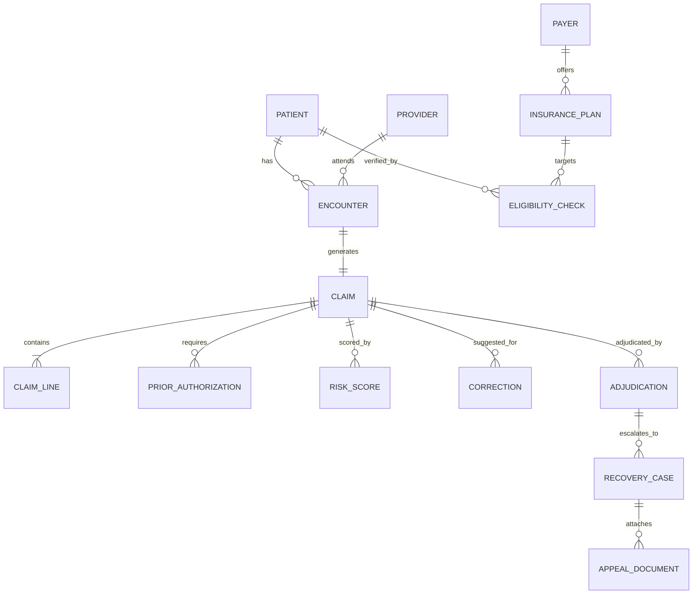

# Canonical Data Model Specification

This document defines the authoritative entity models, relational mappings, and enums for the Claim Intelligence Platform. All database models (`apps/api/models/`), Pydantic schemas (`apps/api/schemas/`), and TypeScript interfaces (`packages/types/`) must strictly conform to these definitions.

---

## 1. Entity Relationship Diagram (ERD)

---

## 2. Core Entities

### 2.1 Patient
Represents the insured patient receiving healthcare services.
- `id`: `String` (UUID / PK)
- `first_name`: `String` (Required)
- `last_name`: `String` (Required)
- `date_of_birth`: `Date` (YYYY-MM-DD)
- `gender`: `Enum` (`MALE`, `FEMALE`, `OTHER`, `UNKNOWN`)
- `member_id`: `String` (Payer subscriber/member identifier)
- `group_number`: `String` (Optional employer group number)
- `address`: `String`
- `created_at`: `DateTime`

### 2.2 Provider
Represents the rendering or billing physician / healthcare facility.
- `id`: `String` (UUID / PK)
- `npi`: `String` (10-digit National Provider Identifier with Luhn checksum)
- `name`: `String` (Provider or Facility Name)
- `taxonomy_code`: `String` (HIPAA specialty taxonomy code)
- `tax_id`: `String` (Federal Employer Identification Number or SSN)
- `in_network`: `Boolean` (Network status with default payers)

### 2.3 Payer & InsurancePlan
- **Payer**:
  - `id`: `String` (PK)
  - `name`: `String` (e.g. `Medicare Part B`, `Blue Cross Blue Shield`, `UnitedHealthcare`, `Aetna`)
  - `payer_id`: `String` (National 5-digit clearinghouse identifier, e.g. `00123`)
  - `timely_filing_days`: `Integer` (Standard timely filing window, e.g. 90, 180, 365)
  - `requires_auth_for_advanced_imaging`: `Boolean`
- **InsurancePlan**:
  - `id`: `String` (PK)
  - `payer_id`: `String` (FK -> Payer)
  - `plan_name`: `String` (e.g. `Silver Choice PPO`, `Medicare Advantage Complete`)
  - `plan_type`: `Enum` (`HMO`, `PPO`, `EPO`, `POS`, `MEDICARE`, `MEDICAID`)
  - `annual_deductible`: `Decimal`
  - `copay_specialist`: `Decimal`
  - `coinsurance_percentage`: `Decimal`

### 2.4 Encounter
Clinical encounter between patient and provider.
- `id`: `String` (UUID / PK)
- `patient_id`: `String` (FK -> Patient)
- `provider_id`: `String` (FK -> Provider)
- `service_date`: `Date`
- `place_of_service`: `String` (CMS POS code: `11` Office, `21` Inpatient, `22` Outpatient)
- `primary_diagnosis_code`: `String` (ICD-10-CM, e.g. `M25.561`)
- `secondary_diagnosis_codes`: `Array[String]` (Additional ICD-10-CM codes)
- `clinical_notes`: `String` (Clinical documentation summary)

### 2.5 Claim & ClaimLine
The central billing unit (equivalent to CMS-1500 / 837P).
- **Claim**:
  - `id`: `String` (UUID / PK)
  - `claim_number`: `String` (Unique alphanumeric identifier, e.g. `CLM-2026-00491`)
  - `patient_id`: `String` (FK -> Patient)
  - `provider_id`: `String` (FK -> Provider)
  - `payer_id`: `String` (FK -> Payer)
  - `encounter_id`: `String` (FK -> Encounter)
  - `status`: `Enum` (`DRAFT`, `VERIFIED`, `READY_FOR_SUBMISSION`, `SUBMITTED`, `ADJUDICATED`, `APPEAL_IN_PROGRESS`, `CLOSED`)
  - `total_billed_amount`: `Decimal`
  - `service_date`: `Date`
  - `filing_deadline`: `Date`
  - `created_at`: `DateTime`
  - `updated_at`: `DateTime`
- **ClaimLine**:
  - `id`: `String` (UUID / PK)
  - `claim_id`: `String` (FK -> Claim)
  - `line_number`: `Integer`
  - `cpt_code`: `String` (5-digit CPT/HCPCS code, e.g. `99214`, `72148`)
  - `modifiers`: `Array[String]` (e.g. `["25"]`, `["LT"]`)
  - `diagnosis_pointers`: `Array[Integer]` (References to claim diagnoses 1-4)
  - `units`: `Integer`
  - `unit_price`: `Decimal`
  - `total_amount`: `Decimal`

---

## 3. Intelligence & Auxiliary Entities

### 3.1 EligibilityCheck
HIPAA 270/271 real-time eligibility verification inquiry and response.
- `id`: `String` (PK)
- `patient_id`: `String` (FK -> Patient)
- `payer_id`: `String` (FK -> Payer)
- `check_date`: `DateTime`
- `is_active`: `Boolean`
- `effective_date`: `Date`
- `termination_date`: `Date` (Optional)
- `deductible_total`: `Decimal`
- `deductible_met`: `Decimal`
- `copay_amount`: `Decimal`
- `raw_response`: `JSON`

### 3.2 PriorAuthorization
Prior authorization tracking for medical procedures.
- `id`: `String` (PK)
- `claim_id`: `String` (FK -> Claim)
- `cpt_code`: `String`
- `authorization_number`: `String` (e.g. `AUTH-99214-X`)
- `status`: `Enum` (`NOT_REQUIRED`, `PENDING`, `APPROVED`, `DENIED`, `EXPIRED`, `MISSING`)
- `approved_units`: `Integer`
- `valid_from`: `Date`
- `valid_to`: `Date`

### 3.3 RiskScore & RiskFactor
Composite multi-factor denial probability assessment.
- **RiskScore**:
  - `id`: `String` (PK)
  - `claim_id`: `String` (FK -> Claim)
  - `overall_score`: `Integer` (0 to 100, where 0 = cleanest claim, 100 = guaranteed denial)
  - `risk_level`: `Enum` (`LOW` [0-29], `MEDIUM` [30-69], `HIGH` [70-100])
  - `eligibility_subscore`: `Integer` (0-100)
  - `authorization_subscore`: `Integer` (0-100)
  - `coverage_subscore`: `Integer` (0-100)
  - `quality_subscore`: `Integer` (0-100)
  - `calculated_at`: `DateTime`
- **RiskFactor**:
  - `id`: `String` (PK)
  - `risk_score_id`: `String` (FK -> RiskScore)
  - `impact_points`: `Integer` (e.g. `+30`)
  - `category`: `Enum` (`ELIGIBILITY`, `AUTHORIZATION`, `COVERAGE`, `DATA_QUALITY`, `TIMELY_FILING`)
  - `title`: `String`
  - `description`: `String`
  - `likely_carc_code`: `String` (e.g. `CO-197` for missing auth)

### 3.4 Correction
Data quality and auto-remediation suggestions.
- `id`: `String` (PK)
- `claim_id`: `String` (FK -> Claim)
- `field_name`: `String` (e.g. `payer_name`, `diagnosis_code`, `provider_npi`)
- `original_value`: `String`
- `suggested_value`: `String`
- `reason`: `String`
- `confidence`: `Decimal` (0.00 to 1.00)
- `status`: `Enum` (`PENDING`, `APPLIED`, `REJECTED`)

---

## 4. Adjudication & Revenue Recovery Entities

### 4.1 Adjudication & AdjudicationLine
Simulates 835 Electronic Remittance Advice (ERA) from payers.
- **Adjudication**:
  - `id`: `String` (PK)
  - `claim_id`: `String` (FK -> Claim)
  - `adjudication_date`: `DateTime`
  - `status`: `Enum` (`PAID`, `DENIED`, `UNDERPAID`, `PENDING`)
  - `billed_amount`: `Decimal`
  - `allowed_amount`: `Decimal`
  - `contractual_adjustment`: `Decimal`
  - `payer_paid_amount`: `Decimal`
  - `patient_responsibility`: `Decimal`
- **AdjudicationLine**:
  - `id`: `String` (PK)
  - `adjudication_id`: `String` (FK -> Adjudication)
  - `claim_line_id`: `String` (FK -> ClaimLine)
  - `paid_amount`: `Decimal`
  - `carc_code`: `String` (Claim Adjustment Reason Code, e.g. `PR-1`, `CO-45`, `CO-197`, `CO-16`)
  - `carc_description`: `String`
  - `rarc_code`: `String` (Remittance Advice Remark Code, e.g. `N56`)

### 4.2 RecoveryCase & AppealDocument
Tracks denied or underpaid claims through resolution.
- **RecoveryCase**:
  - `id`: `String` (PK)
  - `claim_id`: `String` (FK -> Claim)
  - `adjudication_id`: `String` (FK -> Adjudication)
  - `revenue_at_risk`: `Decimal`
  - `recoverability_score`: `Integer` (0 to 100)
  - `priority`: `Enum` (`URGENT`, `HIGH`, `MEDIUM`, `LOW`)
  - `status`: `Enum` (`NEW`, `PACKET_GENERATED`, `SUBMITTED_TO_PAYER`, `RESOLVED_PAID`, `ABANDONED`)
  - `recommended_action`: `Enum` (`CORRECTED_CLAIM`, `RECONSIDERATION`, `FIRST_LEVEL_APPEAL`, `PEER_TO_PEER`)
  - `filing_deadline`: `Date`
- **AppealDocument**:
  - `id`: `String` (PK)
  - `recovery_case_id`: `String` (FK -> RecoveryCase)
  - `document_type`: `Enum` (`APPEAL_LETTER`, `CLINICAL_SUMMARY`, `CORRECTED_CLAIM_FORM`)
  - `content`: `Text`
  - `created_at`: `DateTime`
